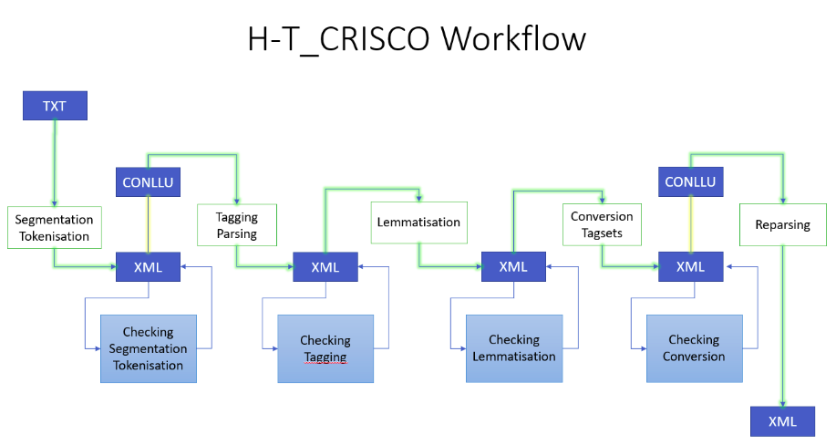

# Introduction:
H-T_CRISCO is a semi-automated iterative workflow that allows researchers to syntactically annotate and lemmatise prose texts in French of any period, from Old to Modern French. The workflow proposes a well-defined strategy for integrating automatic tools into the building of diachronic corpora in XML-TEI format and facilitates access to new technologies via a well-defined process. The workflow will be of use to a wide range of researchers in linguistics and in humanities who wish to add syntactic annotation and/or lemmatisation and/or named entity annotation to their corpora and would like to combine automatic annotation with full control over their work that is achieved via several stages of verification. 
H-T workflow was developed as part of the High-Tech [High-Level Text Annotation Across Historical Texts](https://crisco.unicaen.fr/recherche/projet-rin-high-tech-1089578.kjsp?RH=1531402918899) project.\* This project centres around the creation of a syntactically annotated corpus of Norman chronicles spanning the period from the twelfth to the nineteenth century. The workflow was additionally tested during the construction of the French-language part the MICLE [Micro-Cues of Language Evolution](https://www.unicaen.fr/projet_de_recherche/micle/) project corpus.\*\* Both projects are hosted by the [CRISCO Lab](http://crisco.unicaen.fr/accueil-crisco-863157.kjsp) at the University of Caen. First versions of the two corpora can be consulted via [CRISCO Lab’s TXM portal](https://txm-crisco.huma-num.fr/txm/) (please refer to the documentation on the site for further information). Most texts used in the corpora have between 35,000 and 50,000 tokens each.\*\*\* 
H-T workflow is centred around the use of the [HOPS parser](https://github.com/hopsparser/hopsparser), a deep-learning tool (Grobol et Crabbé, 2021) that offers annotation in parts of speech (PoS) and syntactic functions in the [Universal Dependencies](https://universaldependencies.org/) (UD) system and centres around the model developed for Old French using the [SRCMF corpus](https://universal.grew.fr/?corpus=UD_Old_French-SRCMF@2.12). UD annotation is further enhanced by lemmatisation and PoS tagging in two more systems, UPenn and Presto which offer a more fine-grained analysis.

\*Funded by Réseau d’Intérêts Normands (RIN) for the period between November 2021- October 2023.

\*\*Funded by Agence Nationale de Recherche (ANR) and Deutsche Forschungsgemeinschaft (DFG) for the period between June 2021-May 2024, MICLE project is constructing a calibrated corpus of legal texts in French from Normandy and the British Isles, on the one hand, and a parallel corpus in Venetian, on the other.

\*\*\*Datasets will be made available in Autumn-Winter 2023 for High-Tech and in Summer 2024 for MICLE project.

# Requirements:
In order to use H-T workflow, you will need to install HOPS parser on your computer by following instructions on https://github.com/hopsparser/hopsparser and download [UD_Old_French-SRCMF-2.9-flaubert_base_cased+mlm-fro model](https://zenodo.org/record/6542539).

In addition, you will need to download Presto dictionary file ([original](https://unicloud.unicaen.fr/index.php/s/NSkPrcaZ3Rx2t9P) or [revised](https://unicloud.unicaen.fr/index.php/s/YgfYJenQMKD8bEC) versions)\* that is used for lemmatisation and tagset conversion and the [tagset conversion table](https://unicloud.unicaen.fr/index.php/s/CAdFCbGgGKFHrai). You can download the scripts from the GitHub project or execute them from the GitHub project using an environment such as [GitHub Desktop](https://desktop.github.com/)

\* Versions of the dictionary produced as part of the [Presto project](http://presto.ens-lyon.fr/). See [Lay M.H.& Pincemin B. (2010)](https://www.ledonline.it/ledonline/JADT-2010/allegati/JADT-2010-1045-1056_106-Lay.pdf).

# Structure of the GitHub project:
H-T_CRISCO project contains scripts for the five phases of the workflow that should be executed separately as the work on each text of the corpus progresses.
There is also a “tools” folder that contains scripts for individual operations that are integrated into the main phases of the workflow but can be executed separately if needed. For example, the second phase of the workflow includes renumbering of the tokens in the XML file, conversion from XML to CONLLU format, execution of HOPS parser (that requires CONLLU), conversion from CONLLU back to XML and synchronisation with the original XML file, which are done using “tools” scripts.
If you wish to use the Workflow locally on your machine it is therefore vital to download the whole project including the “tools” folder.

# Principles of the H-T Workflow:
H-T Workflow consists in five phases that allow to progress from a plain digitised text in TXT format to an XML file enriched with linguistic metadata.
Warning: Please note that the workflow was conceived for edited texts with punctuation and expanded abbreviations. It will require significant adaptation for diplomatic editions. Although it can work on verse text, the workflow cannot currently accommodate line structure annotated by <l> tags.
The Workflow allows:
1. wherever needed, to preserve the structure of the original in books, chapters, sections and paragraphs
2. to enrich the text at token level with PoS information, lemmatisation, syntactic function and dependency annotation

At each phase of the Workflow, the text will be enriched with the following metadata :
1. Phase 1: text segmented into books, chapters, sections and paragraphs element 
, attributes section=“book” or “chapter” or “section”). Within the paragraph, text is segmented into sentences (\<s> element) and tokens (\<w> element). Each book, chapter, section, paragraph, sentence and token are numbered (attribute n).

\<w n="3">appellez\</w>

In Phase 1, metadata is added at token level, although the structure and limits of books, chapters, sections, paragraphs, sentences and tokens can be altered manually at any stage.

[read more about Phase 1 in the Wiki](https://github.com/RZiane/HT_CRISCO/wiki/Phase-1:-Sentence-Segmentation-and-Tokenisation)

In Phase 2, syntactic function and the reference to the parent token in the sentence (in the UD system) as well as the UD part of speech* are added (attributes udpos). 
[read more about Phase 2 in the Wiki](https://github.com/RZiane/HT_CRISCO/wiki/Phase-2:-PoS-tagging-and-sentence-parsing-using-HOPS-parser)

\<w join="_" n="3" head="0" function="root" udpos="VERB" >appellez\</w>

In Phase 3, lemma is added (attribute lemma) wherever possible, a modern French lemma or a lemma from the [Dictionnaire du Moyen Français](http://zeus.atilf.fr/dmf/) is used

[read more about Phase 2 in the Wiki]()

\<w join="_" n="3" head="0" function="root" lemma="appeler" udpos="VERB" >appellez\</w>

4. Attributes uppos (for the UPenn system of PoS annotation) and prpos (for the Presto system) are added)

[read more about Phase 2 in the Wiki]()

\<w join="_" n="3" head="0" function="root" lemma="appeler" udpos="VERB" prpos="Ge" uppos="VPP">appellez\</w>

5. Since the sentence segmentation and token structure of the text are likely to have been changed during the process of revision, in this final stage the text is reparsed and the attributes containing syntactic function and reference to the parent token are updated.

*For the attributes used for the parts of speech in Universal Dependencies, UPenn and Presto systems, see the Conversion table. 
